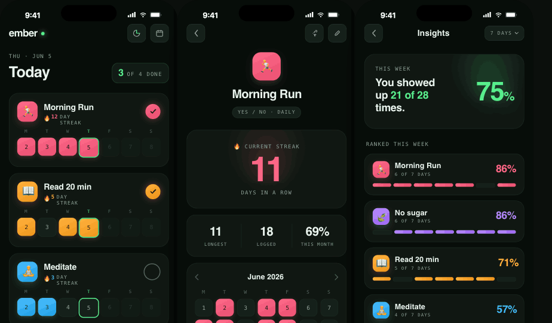
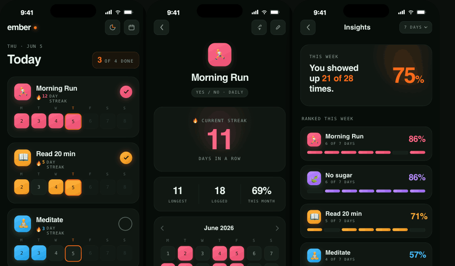

# Handoff: ember — App Redesign (Home · Details · Insights)

A visual redesign of the ember habit-/workout-tracker. Three core screens, carrying the
same design system as the ember share cards (dark surfaces, **Space Grotesk + JetBrains
Mono**, a single bright brand accent). This bundle is a **design reference**, not
production code — recreate these screens in the ember app using its existing patterns.

| Screen | Before | After (green) |
|---|---|---|
| Home, Details, Insights | `prototype/before/*.png` | `reference/green.png` |

The brand accent ships in **two candidates** — neon green (matches the share cards) and
ember-orange `#FF6B1A`. Both are in the reference images and the live prototype; **the
team still needs to pick one** (see "Open decision" below).

---

## How to use this bundle
- **`prototype/prototype.html`** — open in a browser. Shows all three screens side by side
  with a **Green / Orange** toggle in the top bar. This is the source of truth for the look.
- **`prototype/ember-app.jsx`** — the React/JSX implementation of every screen and shared
  component. Read it for exact values; it is the spec in code form.
- **`reference/green.png`, `reference/orange.png`** — rendered targets to match.
- **`prototype/before/*.png`** — the current screens, for comparison.

> The prototype uses React + inline styles purely as a fast medium. Reimplement in the
> app's real framework (the ember app is **Flutter** — see "Flutter notes").

---

## Design system

### Surfaces & text
| Token | Value | Use |
|---|---|---|
| `bg` | `#070D09` | screen background |
| `card` | `#101712` | card surface |
| `cardHi` | `#16201A` | raised chip / empty cell / icon button |
| `border` | `rgba(120,180,140,0.10)` | card border |
| `borderSoft` | `rgba(120,180,140,0.05)` | empty-cell border |
| `text` | `#EAF4EE` | primary text |
| `dim` | `#8AA396` | secondary / labels |
| `dimmer` | `#55695D` | tertiary / future dates / unchecked ring |

### Brand accent (pick ONE)
| | `neon` | `bright` | `deep` | `ink` (text on accent) |
|---|---|---|---|---|
| **Green** | `#57F08C` | `#86FFB1` | `#2FCB6E` | `#06170D` |
| **Orange** | `#FF6B1A` | `#FF8A45` | `#E85600` | `#1E0A00` |

The accent drives: the **wordmark dot**, the **"today" ring** on calendars/week-strips,
the **today-summary chip**, the **primary "Add Activity" button**, and the **Insights hero
number + highlighted figures**. Filled cells/buttons use a 155° `bright → deep` gradient.

### Per-habit colors (independent of the brand accent)
Each habit owns an identity color, used ONLY on its **icon tile**, its **completed
calendar/week cells**, its **checkmark**, and its **Insights row %/bars** — never on global
chrome. Curated set:
| Name | base | deep | ink |
|---|---|---|---|
| coral | `#FF6B8A` | `#E84C6F` | `#2A0710` |
| amber | `#FFB23E` | `#F0951B` | `#291800` |
| sky | `#4FC1FF` | `#1E9FE6` | `#04202E` |
| violet | `#B98BFF` | `#9A63F0` | `#1A0A2E` |

### Typography
- **Display / numbers:** Space Grotesk (600 for headings & big stats; 500–600 in cells).
  Negative tracking on large sizes (`-0.02em` to `-0.04em`).
- **Labels / data:** JetBrains Mono, weight 500, **UPPERCASE**, letter-spacing `0.14em`.
  Used for dates, "DAY STREAK", stat captions, weekday letters, "OF 4 DONE", etc.
- Both are free Google Fonts.

### Shape & elevation
- Cards: radius **20–24px**, 1px border, no heavy shadows.
- Calendar / week cells: radius ~**30%** of cell, filled cells get a soft colored glow
  (`0 3px 10px <color>33`) + a 1px top inset highlight.
- Checkmark / icon tiles: radius ~**30%**; filled gets `0 0 16px <color>73` glow.
- Primary button: radius 18px, accent gradient, `ink` text, `0 8px 24px <accent>4d` glow.

---

## Screen-by-screen

### Home
- Header: `ember` wordmark + dot, two icon buttons (insights, calendar).
- **Today summary:** mono date label, large "Today", and an accent chip "**N of M done**".
- **Activity cards** (one per habit): icon tile · name · 🔥 streak chip (in habit color) ·
  a **circular checkmark** (filled = habit color when done today, hollow ring otherwise).
  Below: a **7-day week-strip** with real dates, states = done (habit-color fill) /
  empty (dark) / today (accent ring) / future (dimmed).
- Sticky **"+ Add Activity"** primary button at the bottom.
- *Fixes vs. current:* removed the redundant "Completed / Not done today" text; unified the
  three different button styles into one primary; gave the week-strip real dates & states.

### Activity Details
- Back button + share/edit icon buttons.
- **Hero identity:** large icon tile, habit name, a "Yes / No · Daily" type pill.
- **Current-streak hero:** one big number (habit color, glowing) — the emotional payload.
- **Supporting stats row:** Longest · Logged · This-month % (de-emphasized, equal weight).
- **Month calendar** with prev/next, same cell treatment as the share cards; today = accent ring.
- Secondary **"View full year"** button (subtle style, not a third button language).
- *Fixes vs. current:* replaced four identical "1" boxes with a clear hierarchy; dropped the
  confusing "Daily Average" metric for a Yes/No habit.

### Insights
- Back button, "Insights" title, a **range pill** ("7 days ▾").
- **Completion hero:** "You showed up **21 of 28** times" + a big accent **75%**.
- **Ranked list:** each habit as a row — icon, name, "N of 7 days", a big **%** in the habit
  color, and a 7-segment week bar.
- *Fixes vs. current:* the old empty-looking bar chart (and literal "0%" bar) is gone;
  the ranked list leads, sorted by completion.

---

## Open decision
**Brand accent: green vs. orange `#FF6B1A`.** Orange reads as fire/heat (on-brand for the
name *ember*); green matches the existing share cards and pops slightly more on the dark
background. Pick one and apply it as the single accent everywhere listed under "Brand
accent" above. (In the prototype, both are just the `GREEN` / `ORANGE` palette objects — a
one-line swap.)

---

## Flutter notes
The ember app is Flutter; reuse the patterns already established in the share-card port:
- Define the palette + accent as `Color` constants / a small theme object. Make the brand
  accent a single source of truth so green↔orange is one change.
- 155° gradients: CSS uses 155°, Flutter `LinearGradient` topLeft→bottomRight is 135° — set
  `begin`/`end` with an `Alignment` (or `GradientRotation`) for an exact match.
- Cell "top sheen": Flutter has no inset shadow — fake it with a 1px top highlight line or a
  short top-to-transparent gradient overlay (same approach as the share-card `DayCell`).
- Mono labels: `GoogleFonts.jetBrainsMono`, uppercase, `letterSpacing` ≈ fontSize × 0.14.
- Drive everything from real data: streak = longest consecutive run; week-strip = last 7
  days with done/empty/today/future; Insights % = done ÷ scheduled in range.
- Hit targets: keep checkmarks / icon buttons ≥ 44pt even though the visuals are smaller.

## Suggested prompt for Claude Code
> Implement the ember app redesign for the Home, Activity Details, and Insights screens per
> `app-redesign-handoff/README.md`. Use `prototype/ember-app.jsx` as the spec and match
> `reference/green.png`. Apply the brand accent as a single themeable value (we'll choose
> green or orange `#FF6B1A`), keep per-habit colors on habit-owned elements only, and wire
> every stat/calendar/streak to real data. Reuse our existing share-card widgets where they
> overlap (DayCell, month grid).
