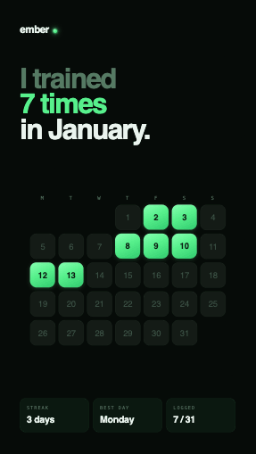

# Handoff: ember — "Editorial" Workout Share Card

A shareable achievement image (Spotify-Wrapped / Duolingo style) that a user posts to
Instagram / TikTok Stories from the **ember** workout app. This bundle covers **one
design — the "Editorial" card.**

---

## About the design files

The files in `prototype/` are a **design reference built in HTML/React** — a prototype
showing the intended look, not production code to ship. Your job is to **recreate this
card in the ember Flutter app** using its existing patterns, then render it to a PNG the
user can share.

A first-pass Flutter port is already included at **`ember_share_card.dart`** — treat it
as a strong starting point, not finished code. The **"Design changes needed"** section
below lists exactly what to refine.

**Fidelity: high.** Colors, type, spacing, and the cell treatment are final. Match them
precisely.

---

## What this card is

A 9:16 story (1080 × 1920) on a near-black background:

1. **Wordmark** top-left — lowercase `ember` + a glowing neon dot.
2. **Editorial headline** — three lines, three colors: a muted lead-in, the hero stat in
   neon, and the resolution in white.
3. **Calendar heat-map** — the centerpiece. A Monday-start month grid; days the user
   worked out are filled neon-green tiles with a glow, the rest are dark tiles.
4. **Stat row** — three translucent neon pills: Streak, Best Day, Logged.

The sample data is **January 2026**: worked-out days `{2, 3, 8, 9, 10, 12, 13}` →
7 days logged, longest streak 3 (Jan 8–10), best day Monday. Jan 1 2026 is a **Thursday**,
so the Monday-start grid has **3 leading blanks**.

---

## Design tokens

### Colors
| Token | Hex | Use |
|---|---|---|
| `bg` | `#060B08` | card background (solid) |
| `cell` | `#141B16` | empty day tile |
| `cellBorder` | `rgba(120,180,140,0.07)` → `0x12A0C68C` | empty tile 1px border |
| `neon` | `#57F08C` | hero stat text, glow, accents |
| `neonBright` | `#86FFB1` | gradient top, dot highlight |
| `neonDeep` | `#2FCB6E` | gradient bottom |
| `ink` | `#062012` | number on a filled (logged) tile |
| `text` | `#EAF4EE` | primary white text |
| `dim` | `#557A63` | headline lead-in, label text |
| `dimmer` | `#3C5247` | number on an empty tile |

### Typography
- **Display / numbers:** **Space Grotesk** — headline weight 600; cell numbers weight
  600 (logged) / 500 (empty).
- **Small labels:** **JetBrains Mono** — weight 500, UPPERCASE, letter-spacing `0.18em`.
- Both are free Google Fonts. In Flutter use the `google_fonts` package
  (`GoogleFonts.spaceGrotesk`, `GoogleFonts.jetBrainsMono`) — no asset bundling required.
  If you prefer offline/deterministic fonts, bundle the `.ttf`s under `assets/fonts/` and
  declare them in `pubspec.yaml`.

### Type scale (at the true 1080×1920 size)
| Element | Font | Size | Weight | Tracking | Notes |
|---|---|---|---|---|---|
| Headline | Space Grotesk | 118px | 600 | `-0.05em` | line-height `0.92`, 3 lines |
| Wordmark | Space Grotesk | 44px | 600 | `-0.04em` | |
| Stat value | Space Grotesk | 40px | 600 | `-0.03em` | white |
| Stat label | JetBrains Mono | 20px | 500 | `0.18em` | uppercase, `dim` |
| Weekday letter | JetBrains Mono | ~21px (cell·0.2) | 500 | `0.1em` | `dim` |
| Cell number | Space Grotesk | ~36px (cell·0.34) | 600/500 | `-0.02em` | |

> Sizes scale linearly — at a 360pt logical card, multiply by `360/1080 ≈ 0.333`.

### The day-cell treatment (the part to get exactly right)
| Property | Logged (worked out) | Empty |
|---|---|---|
| Fill | linear gradient **~155°**: `#86FFB1` 0% → `#57F08C` 45% → `#2FCB6E` 100% | solid `#141B16` |
| Border | none | 1px `rgba(120,180,140,0.07)` |
| Corner radius | **26% of cell size** | 26% of cell size |
| Glow | drop shadow `rgba(87,240,140,0.22)`, blur ≈ 16% of cell, offset y `+4` | none |
| Top sheen | 1px inset highlight `rgba(255,255,255,0.35)` along the top edge | none |
| Number color | `#062012` (ink) | `#3C5247` (dimmer) |

### Stat pill
- Background `rgba(87,240,140,0.06)` → `0x0F57F08C`
- Border 1px `rgba(87,240,140,0.14)` → `0x2457F08C`
- Corner radius 24px (at 1080 scale), padding ~26×28px
- Three pills in an equal-width row, 18px gap

### Layout (at 1080×1920)
- Card padding: `100px 84px 92px` (top, sides, bottom).
- Vertical order with flexible space: wordmark → (120px gap) → headline → **flex spacer**
  → calendar (centered) → **flex spacer** → stat row pinned to the bottom.
- Calendar: 7 columns, cell ≈ 106px, gap 14px, weekday header row above the grid.

---

## Calendar logic (make it data-driven)
The prototype hardcodes January. In the app, drive it from real data:
- Input: `year`, `month`, and a `Set<int>` of logged day numbers.
- `leadingBlanks` = weekday index of the 1st with **Monday = 0** (`(DateTime(y,m,1).weekday + 6) % 7`).
- Render `leadingBlanks` empty spacers, then days `1..daysInMonth`.
- Derive the stats from the data: **logged** = count; **streak** = longest run of
  consecutive logged days; **best day** = weekday with the most logged days.
- Headline hero number = logged count; keep the copy template
  `"I trained / N times / in <Month>."` (singular "1 time").

---

## Design changes needed (refine the included Dart)
`ember_share_card.dart` is a faithful but quick port. Before shipping, address these:

1. **Gradient angle.** CSS uses **155°**; the Dart uses `topLeft → bottomRight` (135°).
   For an exact match, set `LinearGradient.begin/end` using `Alignment` rotated to 155°
   (e.g. `begin: Alignment(-0.9, -1), end: Alignment(0.9, 1)`), or use a `GradientRotation`
   transform. The 20° difference is subtle but visible side-by-side.
2. **Top sheen.** Flutter has no `inset` box-shadow, so the port fakes the sheen with a
   1px white line. Acceptable, but for fidelity consider an inner `Container` with a top
   `LinearGradient` from `rgba(255,255,255,0.35)` fading to transparent over the top ~30%.
3. **Make it data-driven.** Replace the hardcoded `{2,3,8,9,10,12,13}` / "January" /
   "7 times" with the computed values described in *Calendar logic* above.
4. **Don't hardcode `cell: 35`.** The composed card uses a tiny cell so it fits a 360pt
   canvas. Keep the card at a fixed **logical aspect 9:16** and derive `cell` from the
   available width (`(contentWidth - 6*gap) / 7`) so it scales cleanly to any export size.
5. **Export resolution.** Share at **1080×1920**. Render the card at logical 360×640 and
   capture with `RepaintBoundary.toImage(pixelRatio: 3.0)` → 1080×1920 PNG. See
   `captureCard()` in the Dart file. Bump `pixelRatio` for higher-res, never the logical size.
6. **Fonts at capture time.** `RepaintBoundary` capture can fire before Google Fonts load,
   producing a fallback-font PNG. `await GoogleFonts.pendingFonts([...])` (or pre-warm the
   fonts) before calling `captureCard()`.
7. **Letter-spacing units.** CSS `em` tracking is relative to font size; the Dart converts
   to absolute px per style. If you change a font size, recompute its `letterSpacing`.

---

## Files in this bundle
- `editorial_card_reference.png` — rendered reference image of the final design.
- `ember_share_card.dart` — first-pass Flutter implementation (palette, `DayCell`,
  `CalendarGrid`, `EmberShareCard`, `captureCard`). Requires `google_fonts`.
- `prototype/editorial_card.html` — the live HTML prototype; open it in a browser to
  inspect the real design (auto-fits the viewport).
- `prototype/share-cards.jsx` — source for the prototype (all three card variants live
  here; only `EmberCardEditorial` is in scope for this handoff).

## Suggested prompt for Claude Code
> Implement the ember "Editorial" workout share card in our Flutter app per
> `design_handoff_editorial_card/README.md`. Start from `ember_share_card.dart`, apply the
> "Design changes needed" items, wire it to real workout data, and add a share action that
> exports a 1080×1920 PNG via RepaintBoundary. Match `editorial_card_reference.png` exactly.
